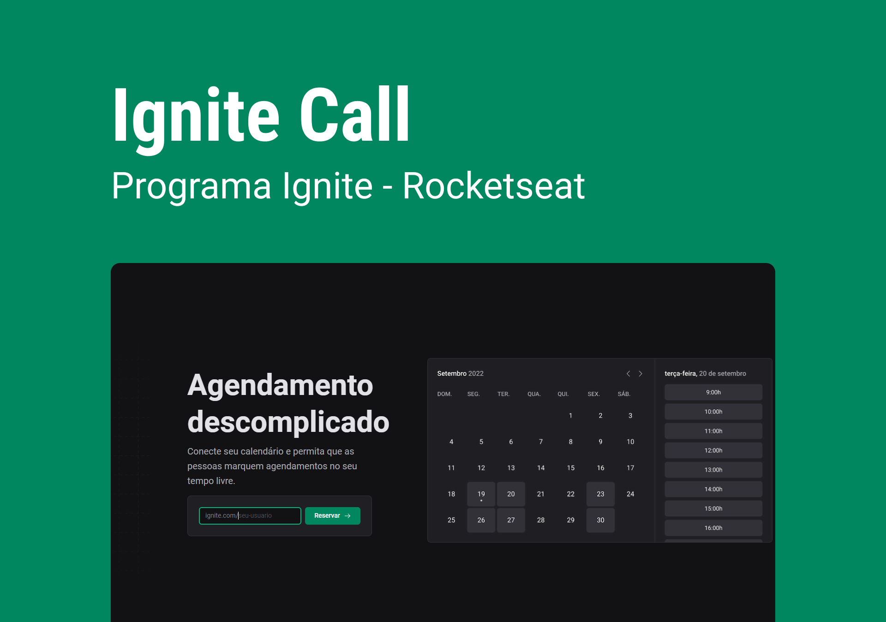

  

## 🎉 Let's go!

Para iniciar o projeto insira o comando <code>npm run dev</code>

## 💻 Projeto

Um projeto fullstack <strong>(React e Next.js)</strong> que utiliza Design System, rotas em Back-End, validações, API do Google e Prisma para criar uma aplicação de Agendamento conectada ao seu calendário do Google.

## 🚀 Tecnologias

Esse projeto foi desenvolvido com as seguintes tecnologias:

- HTML e CSS
- Typescript
- React
- Node e NPM
- Next JS
- API do Google
- Prisma

## 📚 Bibliotecas

## 🎨 Figma

🔗: https://www.figma.com/file/7K30zbcN8Eojq7qrSfXZi7/Ignite-Call-(Community)?node-id=0%3A1&t=7TrzaldwqP7LijXI-0
